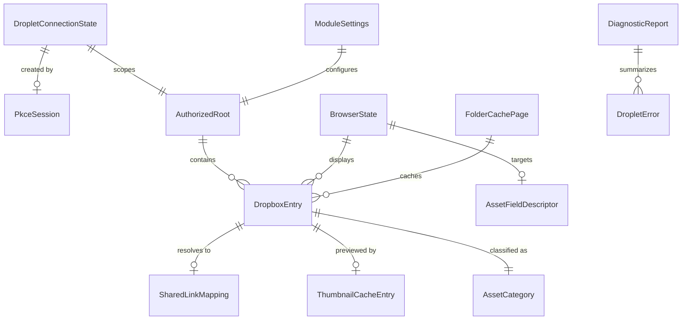

# Phase 1 Data Model: Dropbox Asset Browser

**Feature**: 001-dropbox-asset-browser | **Plan**: [plan.md](plan.md)

All entities are in-memory TypeScript structures or serialized settings values. There is no
database. Persistence targets are stated per entity: `world setting`, `client setting`,
`localStorage`, `memory`, or `foundry document field`.

---

## DropletConnectionState

Persistence: **client setting** only (`droplet.connection`, `scope: "client"`). Never world scope,
never a document.

| Field | Type | Notes |
|---|---|---|
| `accountId` | `string` | Dropbox account id, used as a cache namespace |
| `accountLabel` | `string` | Display name or email shown in settings |
| `accessToken` | `string` | Short-lived; redacted everywhere |
| `refreshToken` | `string \| null` | `null` unless the GM opted into offline access |
| `expiresAt` | `number` | Epoch ms; computed as `issuedAt + expires_in - 60_000` |
| `grantedScopes` | `string[]` | As returned by the token response |
| `accessMode` | `"appFolder" \| "fullDropbox"` | Fixed at connect time |
| `appKey` | `string` | The GM's Dropbox app key |
| `connectedAt` | `number` | Epoch ms |

**Validation**: `accessToken` non-empty; `expiresAt` in the future at write time; `grantedScopes`
must contain every scope in the required set or the state is rejected with `InsufficientScopes`.

**State transitions**:

```text
Disconnected --connect()--> AwaitingAuthorization --completeConnect()--> Connected
AwaitingAuthorization --cancel/timeout--> Disconnected
Connected --access token expired, refreshToken present--> Refreshing --success--> Connected
Refreshing --failure--> Expired
Connected --access token expired, no refreshToken--> Expired
Expired --connect()--> AwaitingAuthorization
Connected|Expired --disconnect()--> Disconnected   (clears the setting and revokes remotely)
```

**Invariants**: exactly one refresh may be in flight; the PKCE verifier is never part of this
entity and lives only in the dialog's memory; `disconnect()` clears the setting even if the remote
revoke call fails.

---

## PkceSession

Persistence: **memory** only, owned by the open settings dialog.

| Field | Type | Notes |
|---|---|---|
| `verifier` | `string` | 43–128 chars from `[0-9a-zA-Z-._~]`, from `crypto.getRandomValues` |
| `challenge` | `string` | base64url of SHA-256 of `verifier` |
| `state` | `string \| null` | Present only in redirect mode |
| `redirectUri` | `string \| null` | Present only in redirect mode |
| `createdAt` | `number` | Used to expire a stale session (default 10 minutes) |

**Validation**: a pasted or received code is rejected with `OAuthStateMismatch` when no session is
pending, when the session has expired, or when redirect-mode `state` does not match exactly.

---

## AuthorizedRoot

Persistence: **world setting** (`droplet.root`).

| Field | Type | Notes |
|---|---|---|
| `path` | `string` | Normalized; `""` in App Folder mode |
| `displayPath` | `string` | Dropbox-cased path for the UI |
| `verifiedAt` | `number \| null` | Last time a `list_folder` call confirmed it exists — `get_metadata` cannot be used, because Dropbox documents that "Metadata for the root folder is unsupported" |

**Validation**: normalized per the root-path policy; must resolve to an existing folder, otherwise
`RootFolderMissing`. In App Folder mode the value is forced to `""` and is not editable.

---

## DropboxEntry

Persistence: **memory**, and inside `FolderCachePage`.

| Field | Type | Notes |
|---|---|---|
| `kind` | `"file" \| "folder"` | From the Dropbox metadata tag |
| `id` | `string` | Dropbox file/folder id |
| `name` | `string` | Untrusted display string; always escaped when rendered |
| `path` | `string` | Normalized, always within the authorized root |
| `displayPath` | `string` | Dropbox-cased |
| `rev` | `string \| null` | Files only; part of every cache key |
| `size` | `number \| null` | Files only |
| `clientModified` | `number \| null` | Files only |
| `category` | `AssetCategory` | Derived, never taken from Dropbox |
| `extension` | `string` | Lowercased, without the dot |
| `hasThumbnail` | `boolean` | From metadata where available |

**Invariants**: `path` must satisfy `isWithinRoot`; an entry that fails is dropped from the page
and recorded as a diagnostic count, never rendered.

---

## AssetCategory

Persistence: none (a derived enum).

`"image" | "audio" | "video" | "other"`, plus a derived boolean `isSvg`.

**Derivation rule**: extension is authoritative; a content-type hint may only *downgrade* a
classification to `"other"`, never upgrade it. An `isSvg` entry is excluded from results unless
`allowSvg` is enabled.

---

## FolderCachePage

Persistence: **memory** (`FolderCache`).

| Field | Type | Notes |
|---|---|---|
| `key` | `string` | Normalized path plus filter signature |
| `entries` | `DropboxEntry[]` | One page |
| `cursor` | `string \| null` | `null` when the folder is fully loaded |
| `hasMore` | `boolean` | |
| `fetchedAt` | `number` | Epoch ms, drives TTL |

**Eviction**: LRU with a 50-folder bound; TTL from `folderCacheTtlSeconds`. An expired page is
discarded rather than served stale.

---

## SharedLinkMapping

Persistence: **localStorage**, schema-versioned (`{ v: 1, entries: [...] }`), and mirrored in
memory.

| Field | Type | Notes |
|---|---|---|
| `fileId` | `string` | Part of the key |
| `rev` | `string` | Part of the key; a new rev forces re-resolution |
| `url` | `string` | Canonical shared link with `raw=1`, `rlkey` preserved |
| `createdByModule` | `boolean` | True when Droplet created rather than adopted the link |
| `validatedAt` | `number \| null` | Last successful media-element probe |

**Validation**: `url` must be `https:`, must have host `www.dropbox.com`, must carry `raw=1`, and
must not carry any `dl` parameter. A value that fails is discarded, not repaired.

**Invariants**: never holds a `files/get_temporary_link` result — that endpoint is not used at all
(RE-013); bounded to 500 entries with LRU eviction; a schema-version mismatch discards the whole
store.

---

## ThumbnailCacheEntry

Persistence: **memory** only.

| Field | Type | Notes |
|---|---|---|
| `key` | `string` | `fileId` + `rev` + size |
| `objectUrl` | `string` | From `URL.createObjectURL` |
| `createdAt` | `number` | |
| `byteLength` | `number` | Decoded size, used for the cache bound |

**Source shape**: `get_thumbnail_batch` returns each thumbnail as a **base64 string inside the
JSON body**, so `PreviewService` decodes to a `Blob` before creating the object URL. The
base64 form is roughly a third larger than the decoded bytes and is discarded immediately; only
decoded sizes count toward the cache bound.

**Invariants**: eviction, application close, and `beforeunload` each call `URL.revokeObjectURL`.
Binary data is never written to `localStorage`.

---

## BrowserState

Persistence: **memory**; a small navigation subset may be restored per session from a client
setting.

| Field | Type | Notes |
|---|---|---|
| `currentPath` | `string` | Always within the authorized root |
| `breadcrumbs` | `{ path: string; label: string }[]` | Derived from `currentPath` |
| `pages` | `DropboxEntry[][]` | Accumulated pages for the current folder |
| `cursor` | `string \| null` | |
| `status` | `"idle" \| "loading" \| "loadingMore" \| "error" \| "empty"` | |
| `error` | `DropletError \| null` | |
| `categoryFilter` | `Set<AssetCategory>` | |
| `nameFilter` | `string` | Client-side, costs no request |
| `displayMode` | `"list" \| "grid"` | |
| `selection` | `DropboxEntry \| null` | |
| `mode` | `"browse" \| "select"` | Select mode carries a target field descriptor |
| `requestedType` | `AssetCategory \| null` | Set by the calling field |
| `inFlight` | `AbortController \| null` | Aborted on navigation and on close |

**Invariants**: changing `currentPath` aborts the in-flight request; `nameFilter` and
`categoryFilter` never trigger a network request; `selection` is cleared when `currentPath`
changes.

---

## AssetFieldDescriptor

Persistence: **memory** (a compile-time registry).

| Field | Type | Notes |
|---|---|---|
| `hookName` | `string` | e.g. `renderSceneConfig` |
| `fieldName` | `string` | e.g. `background.src` |
| `assetType` | `AssetCategory` | Filters the browser |
| `labelKey` | `string` | Localization key for the button |

Release 1 registers exactly one descriptor.

---

## ModuleSettings

Persistence: **world setting** unless marked otherwise.

| Key | Type | Default | Scope | Notes |
|---|---|---|---|---|
| `appKey` | `string` | `""` | world | The GM's Dropbox app key; not a secret in PKCE |
| `accessMode` | `"appFolder" \| "fullDropbox"` | `appFolder` | world | Full Dropbox shows a warning |
| `rootPath` | `string` | `""` | world | Ignored in App Folder mode |
| `allowSvg` | `boolean` | `false` | world | Enabling shows a security warning |
| `offlineAccess` | `boolean` | `false` | world | Opt-in refresh tokens; shows the storage warning. When enabled, the token request sends `refresh_token_expiration_seconds` so the grant expires after 30 days rather than living indefinitely |
| `browsePermissionRole` | `number` | GM | world | Role threshold for opening the browser |
| `folderCacheTtlSeconds` | `number` | `300` | world | 0–3600 |
| `pageSize` | `number` | `200` | world | 25–500; Dropbox caps `limit` at 2000 and treats it as approximate, so the renderer tolerates a longer page than requested |
| `thumbnailBatchSize` | `number` | `25` | world | 1–25; 25 is Dropbox's documented hard ceiling for `get_thumbnail_batch` |
| `thumbnailBatchesInFlight` | `number` | `2` | world | 1–4 |
| `showSharedLinkWarning` | `boolean` | `true` | world | Cleared once acknowledged |
| `connection` | `DropletConnectionState \| null` | `null` | **client** | Never world scope |
| `lastBrowsedPath` | `string` | `""` | **client** | Convenience only |
| `displayMode` | `"list" \| "grid"` | `list` | **client** | |

**Validation**: numeric settings are clamped to their stated ranges on read as well as on write;
an invalid `rootPath` surfaces as `RootFolderMissing` at browse time rather than blocking startup.

---

## DropletError

Persistence: **memory**; a redacted projection may appear in a `DiagnosticReport`.

| Field | Type | Notes |
|---|---|---|
| `code` | `ErrorCode` | Stable, machine-readable |
| `i18nKey` | `string` | Localized user-facing message |
| `recovery` | `RecoveryAction \| null` | e.g. reconnect, retry, refresh folder, open settings |
| `technicalDetail` | `string` | Redacted, safe to display and copy |
| `retryAfterMs` | `number \| null` | Populated for `RateLimited` |
| `cause` | `unknown` | Never rendered; never serialized raw |

Full catalog: [contracts/error-model.md](contracts/error-model.md).

---

## DiagnosticReport

Persistence: **memory**; copied to the clipboard on demand. Never transmitted.

| Field | Type | Notes |
|---|---|---|
| `generatedAt` | `number` | |
| `moduleVersion` | `string` | |
| `foundryVersion` | `string` | Generation and build |
| `adapterName` | `string` | Which `FoundryAdapter` was selected |
| `browser` | `string` | Coarse user-agent summary |
| `connection` | `{ status; accountLabel; accessMode; grantedScopes; expiresInSeconds }` | **No tokens** |
| `settings` | `Partial<ModuleSettings>` | World settings only; `connection` excluded |
| `cacheStats` | `{ folders; thumbnails; links; evictions }` | Counts only |
| `recentErrors` | `{ code; at; technicalDetail }[]` | Bounded to 50, redacted |
| `integrationStatus` | `Record<string, "installed" \| "not-found" \| "disabled">` | Per descriptor |

**Invariants**: the report is produced by passing every string through the `Redactor`. A unit test
asserts that a report generated from a fixture containing tokens, codes, verifiers, and full
shared URLs contains none of them.

---

## Relationships


