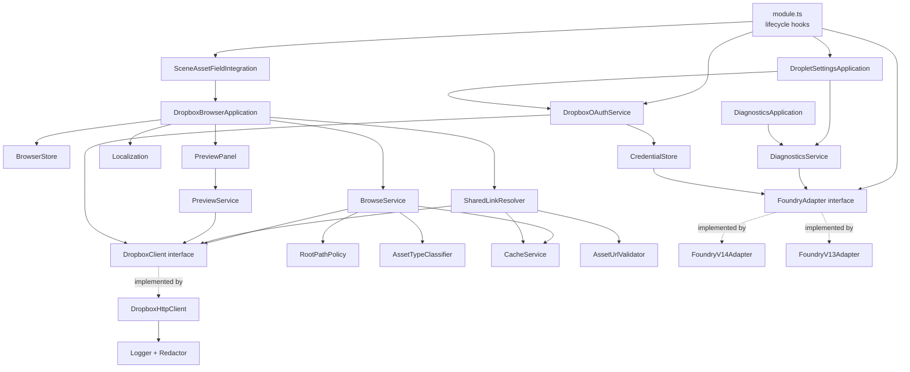

# Implementation Plan: Dropbox Asset Browser

**Branch**: `001-dropbox-asset-browser` | **Date**: 2026-07-28 | **Spec**: [spec.md](spec.md)

**Input**: Feature specification from `/specs/001-dropbox-asset-browser/spec.md`

## Summary

Droplet is a client-side Foundry VTT module (module id `droplet`) that lets an authorized
Game Master browse a Dropbox account from inside Foundry and assign Dropbox-hosted assets to
Foundry documents without uploading anything into Foundry or Forge storage.

Technical approach: a TypeScript ES-module bundle built with Vite, shipped through a standard
Foundry manifest, with no backend service. Authorization uses the OAuth 2 authorization-code
flow with PKCE against a GM-supplied Dropbox app key. Dropbox HTTP endpoints are called
directly from the browser through a project-owned typed client. Selected assets are persisted
as stable Dropbox shared-link URLs in `raw=1` form, never as temporary links. Foundry
integration for the first release is strictly additive: a "Browse Dropbox" control injected via
the public `renderSceneConfig` hook next to the Scene background field, leaving the native
FilePicker untouched.

Four questions are treated as planning gates and are resolved or scheduled as spikes before
release sign-off: OAuth redirect on Forge (**resolved**, ADR-002), token storage location
(**resolved pending empirical confirmation**, ADR-003 + RS-02), persisted URL form (**resolved
pending live confirmation**, ADR-005 + RS-04), and CSP/CORS behavior for Dropbox content under
The Forge (**unresolved release gate**, RS-06).

## Technical Context

**Language/Version**: TypeScript 5.x with `strict: true`, `noUncheckedIndexedAccess`, and
`exactOptionalPropertyTypes`; target ES2022; output native ES modules.

**Primary Dependencies**: none at runtime beyond what Foundry provides. Build and development
only: Vite, `fvtt-types` (with an internal minimal ambient declaration set as fallback),
ESLint + `typescript-eslint`, Prettier, Vitest, `@vitest/coverage-v8`, Playwright. The official
`dropbox` JS SDK is rejected (ADR-004). Validation is hand-written; no runtime schema library.

**Storage**: Foundry **world**-scoped settings for non-sensitive configuration; Foundry
**client**-scoped settings (GM browser `localStorage`) for OAuth state (ADR-003); in-memory LRU
caches for folder listings and thumbnails; a versioned, size-bounded `localStorage` cache for
the shared-link mapping only. Foundry documents hold only stable HTTPS shared-link URLs.

**Testing**: Vitest for unit and integration tests against a mocked `fetch` and a mocked
Foundry global; Playwright for browser-level DOM tests of the browser application rendered
standalone; a documented manual matrix for real Foundry / Forge / Dropbox validation.

**Target Platform**: Browser (current Chromium-based, current Firefox) running Foundry VTT v14
(verified against the 14.365 Stable public API) as primary target and v13 as secondary.
Hosting: The Forge (primary) and self-hosted (secondary).

**Project Type**: Foundry VTT add-on module — a single client-side browser bundle.

**Performance Goals**: first page of a 1,000-entry folder rendered within 3 s on broadband;
zero shared-link API calls during listing; at most one `list_folder` request per page;
thumbnails requested in batches of at most 25 (the documented Dropbox ceiling) with at most 2
batches in flight; no main-thread block longer than 50 ms while paging.

**Constraints**: no backend service; no embedded Dropbox app secret; no Node.js runtime APIs;
no telemetry; no monkey-patching of Foundry core; production bundle under 100 KB minified
before compression; must degrade to a no-op when Dropbox is unavailable.

**Scale/Scope**: one Dropbox account per GM browser; folders of 1,000+ entries; ~14 source
components; the release-1 integration surface is the Scene background field, behind an adapter
designed for additional surfaces.

## Constitution Check

*GATE: evaluated before Phase 0 research and re-evaluated after Phase 1 design.*

### Initial evaluation (pre-Phase 0)

| Gate | Status | Evidence / action |
|---|---|---|
| Security and privacy | PASS with conditions | PKCE mandated (ADR-001/002); no secret shipped; central redaction layer specified; scopes minimized (see the endpoint matrix); root enforced in the service layer. Condition: no token may be written to a world setting — the design avoids world scope entirely, and RS-02 confirms the documentation claim. |
| Stable reference | PASS | ADR-005 fixes the persisted URL form; `files/get_temporary_link` is not used at all — Dropbox documents that its links expire in four hours and "should not be used to display content directly in the browser" (RE-013); reuse and deduplication logic is specified with tests. |
| Foundry compatibility | PASS with conditions | v14 surfaces are named from the 14.365 public API (`foundry.applications.apps.FilePicker`, `renderSceneConfig` as an instance of the documented generic `renderApplicationV2` hook, `CONFIG.ux`); v13 differences are isolated behind `FoundryAdapter`. Condition: RS-07 must confirm v13 hook and class names on a real v13 install before any v13 compatibility claim ships. |
| Architecture | PASS | Component boundaries below map one-to-one onto the constitution's required component list, with enforced dependency direction. |
| Test and evidence | CONDITIONAL | RS-06 (Forge CSP/CORS) is an unresolved release gate for Forge compatibility claims; RS-04 (shared-link form) and RS-05 (media validation under CORS) need live confirmation. Phase 0 schedules all three as evidence work ahead of release sign-off. |
| Documentation and release | PASS | Required documents are enumerated in the Definition of Done; their production is phase-10 work but their scope is fixed here. |

### Post-Phase 1 re-evaluation

| Gate | Status | Notes |
|---|---|---|
| Security and privacy | PASS | No entity in the data model carries a token in world scope or in a document. `DropletConnectionState` is client-scope only and its refresh token never leaves the GM browser. The diagnostic report is defined as a redacted projection. ADR-010 additionally keeps the access token out of request URLs, declining Dropbox's documented pre-flight-avoidance mode. |
| Stable reference | PASS | `SharedLinkMapping` stores only canonical `raw=1` URLs; the `resolveAssetUrl` contract forbids returning a temporary link, and RE-013 removed `files/get_temporary_link` from the design entirely. |
| Foundry compatibility | PASS | The `FoundryAdapter` contract is version-agnostic; two implementations are selected at `init`; an unsupported version yields `UnsupportedVersionAdapter`, which disables integration after one notification. |
| Architecture | PASS | No UI component imports the Dropbox transport; no Dropbox service imports Foundry globals; dependency direction is UI → services → adapters. |
| Test and evidence | CONDITIONAL (unchanged) | RS-06 remains a release gate for Forge sign-off. Implementation phases do not depend on it, but release documentation and compatibility claims do. |
| Documentation and release | PASS | Phase 1 introduced one new documentation obligation, already folded into the Definition of Done: the README must state that revoking a file's shared link does not remove access while a parent-folder link exists. |

**Effect of the Phase 0 documentation review**: reading the Dropbox HTTP API v2 reference in full
produced four corrections rather than confirmations — the PKCE token request sends `client_id`
**and** `code_verifier`; `get_thumbnail_batch` lives on the content host; `get_temporary_link`
must not be used to display content in a browser; and `get_metadata` cannot be called on the root
folder. Each is reflected above and in the endpoint matrix. None of them changed a gate outcome,
but two of them (ADR-010, ADR-011) changed the design.

**Complexity Tracking is empty** — the design introduces no constitution violation.

## Architecture Decision Records

### ADR-001: Client-side-only module, no hosted backend

**Status**: Accepted.
**Decision**: All Dropbox interaction happens in the Foundry client's browser. No component of
this project runs on a server the maintainers operate.
**Rationale**: The constitution lists a hosted backend as out of scope; a backend would also
become a credential custodian and a privacy liability. Dropbox explicitly supports
"single-page applications in pure JavaScript" through PKCE.
**Alternatives rejected**: a token-exchange proxy (reintroduces a secret custodian and an
operated service); a Foundry server-side hook (unavailable on The Forge, the primary target).

### ADR-002: OAuth redirect strategy — code-display flow first, registered redirect optional

**Status**: Accepted. **Answers mandatory checkpoint 1.**
**Decision**: The default, always-available authorization flow is Dropbox's code flow **without**
a `redirect_uri`. Dropbox documents that the `redirect_uri` is optional with the code flow and
that, if unspecified, the authorization code is displayed on dropbox.com for the user to copy
and paste into the app. Droplet opens the authorization URL in a new tab, shows a paste field
in its own dialog, and exchanges the pasted code plus the PKCE verifier at
`https://api.dropboxapi.com/oauth2/token`.

A **secondary, opt-in** mode supports a registered `redirect_uri` equal to the GM's own Foundry
world origin. Because the GM registers their own Dropbox app, they can register their own Forge
or self-hosted URL. In that mode Droplet opens a popup and the landing page returns the code
via `window.opener.postMessage` with a strict target-origin check.
**Rationale**: The code-display flow needs no redirect registration, behaves identically on
Forge and self-hosted worlds, survives page reloads, and requires no external service. Checkpoint
1 is therefore not a blocker.
**Consequence and spec deviation**: `state` is only round-tripped in redirect mode. In
code-display mode there is no cross-site delivery channel at all — the GM types the code into
the same dialog instance that generated the PKCE verifier, and a paste is refused unless a
verifier is pending. FR-006's state check is implemented and enforced for redirect mode; the
code-display equivalent is verifier binding. This nuance must be reflected back into the spec
(risk R-08).
**Alternatives rejected**: loopback `http://localhost` redirect (Foundry clients are not native
apps and Forge worlds are remote); a project-hosted landing page (violates ADR-001).

### ADR-003: OAuth tokens live in GM client-scope settings, never in world settings

**Status**: Accepted pending RS-02. **Answers mandatory checkpoints 2 and 3.**
**Decision**: `DropletConnectionState` (access token, refresh token, expiry, granted scopes,
account label) is stored in a Foundry setting registered with `scope: "client"`, which Foundry
persists in the individual browser's `localStorage`. It is never stored with `scope: "world"`
and never written to any document.
**Rationale**: World-scoped settings are stored server-side and delivered to connected clients;
a GM-only settings *form* does not make a world setting's *value* private, and the constitution
forbids assuming otherwise. Client scope keeps the refresh token in exactly one browser.
**Consequence**: the connection is per-GM-browser, not per-world. A second GM, or the same GM on
another device, connects separately. The settings UI must state this plainly.
**Checkpoint 3 answer — can a client module keep a refresh token meaningfully secret? No.**
Anything in `localStorage` is readable by any script in the same origin, which includes every
other active module and any XSS in Foundry, a system, or a module. This is an accepted,
documented residual risk; no UI copy may claim otherwise.
**Verification (RS-02)**: empirically confirm on v14 and v13 that a world-scope setting's value
reaches a non-GM client and that a client-scope value does not. The design does not depend on
the outcome, but the published documentation claim does.

### ADR-004: Hand-written typed Dropbox HTTP client instead of the official SDK

**Status**: Accepted.
**Decision**: Implement `DropboxHttpClient` over `fetch`, behind the `DropboxClient` interface.
Do not depend on the `dropbox` npm package.
**Rationale**: Droplet uses eleven endpoints. The official SDK ships the full generated API
surface and is a large addition to a bundle that must stay small; it also brings its own auth
object whose lifecycle we would shadow anyway. A hand-written client gives exact control over
`AbortSignal` propagation, `Retry-After` parsing, and typed error mapping, all of which the
constitution requires. Every runtime dependency ships to user clients.
**Alternatives rejected**: the official `dropbox` SDK (size, weaker control over retry and
cancellation, error typing mismatch); a generic HTTP wrapper (unnecessary — `fetch` suffices).
**Consequence**: Droplet owns request/response correctness, covered by fixture-based unit tests
derived from the documented HTTP API.

### ADR-005: Persist the canonical shared link with `raw=1`

**Status**: Accepted pending RS-04. **Answers mandatory checkpoints 6 and 8.**
**Decision**: The value written into a Foundry document is the shared link returned by
`sharing/list_shared_links` or `sharing/create_shared_link_with_settings`, normalized so that
any `dl` parameter is removed and `raw=1` is set, with every other query parameter — notably
`rlkey` — preserved verbatim. Shape:
`https://www.dropbox.com/scl/fi/<id>/<name>?rlkey=<key>&raw=1`.
**Rationale**: Dropbox documents `raw=1` as the supported way to bypass the preview page and let
the browser render the file directly, available to anyone with no restrictions. `dl=1` forces a
download disposition, which is wrong for ``, `<audio>`, and `<video>`. Dropbox also states
that `raw=1` causes an HTTP redirect and that consumers must follow redirects — browsers do this
for media element loads. Dropbox further warns that shared links may already carry query
parameters, so the normalizer parses and rewrites rather than concatenating.
**Explicitly rejected**: rewriting the host to `dl.dropboxusercontent.com` — an undocumented
string hack. **Explicitly forbidden**: persisting `files/get_temporary_link` results.
**Checkpoint 8 answer — privacy properties**: a Dropbox shared link is a capability URL. Anyone
who obtains it can fetch the asset without authentication; `rlkey` is the capability secret.
Diagnostics must never print full shared URLs, and the UI must warn before first use.
**Verification (RS-04)**: confirm on a live account that the normalized URL loads in ``,
`<audio>`, and `<video>` in both target browsers, and record the observed redirect chain.

### ADR-006: Validate resolved URLs with a media-element probe, not `fetch`

**Status**: Accepted pending RS-05. **Partially answers mandatory checkpoint 9.**
**Decision**: `AssetUrlValidator` validates a candidate URL by loading it into a detached
element — `Image.decode()` for images, an `HTMLMediaElement` with `preload="metadata"` awaiting
`loadedmetadata` for audio and video — with a timeout and an abort path. `crossOrigin` is **not**
set, so no CORS preflight or CORS response header is required. `fetch`, `HEAD`, and `no-cors`
opaque probes are not used as the primary strategy: an opaque response cannot distinguish
success from failure, and a CORS-enabled request fails on a host that emits no
`Access-Control-Allow-Origin`.
**Rationale**: media elements are exactly the consumers Foundry will use, so a successful probe
is direct evidence for the real use case, and `preload="metadata"` avoids downloading whole files.
**Residual gap**: this cannot always distinguish "blocked by page CSP" from "asset is broken".
The validator reports `CspOrCorsRestriction` when the probe fails *and* a same-session control
probe against a known-good Dropbox URL also fails, and `UrlValidationFailure` otherwise.

### ADR-007: SVG recognized but disabled by default

**Status**: Accepted.
**Decision**: SVG is classified as an image type but excluded from browsing and selection unless
a GM explicitly enables `allowSvg`. Enabling it shows a warning that a remote SVG can reference
external resources and can behave differently depending on how Foundry renders it. Droplet does
not claim SVG is safe and does not implement a sanitizing renderer in release 1.
**Rationale**: The constitution mandates SVG off by default absent a documented safe rendering
strategy, and the module cannot control how Foundry or a system later renders an asset URL.

### ADR-008: Additive integration via public hooks; no core patching

**Status**: Accepted. **Answers mandatory checkpoints 4 and 5.**

**Checkpoint 4 — Foundry v14 public APIs used**:

| Purpose | v14 public API |
|---|---|
| Lifecycle | `Hooks.once("init")`, `"i18nInit"`, `"setup"`, `"ready"` (documented once-hooks) |
| Settings | `game.settings.register` / `registerMenu` (`foundry.helpers.ClientSettings`) |
| Settings and browser UI | `foundry.applications.api.ApplicationV2` + `HandlebarsApplicationMixin` |
| Confirmations | `foundry.applications.api.DialogV2` |
| Notifications | `ui.notifications` |
| Scene field injection | `Hooks.on("renderSceneConfig", app, element, context, options)` — a concrete instance of the documented generic `renderApplicationV2` hook for `foundry.applications.sheets.SceneConfig` |
| Localization | `game.i18n.localize` / `format`, `languages` in `module.json` |
| Version detection | `game.release.generation`, `game.version` |
| Permission gate | a role-threshold setting evaluated against `CONST.USER_ROLES`, defaulting to GM |

**Checkpoint 5 — fallback when native file-picker source extension is unavailable**: it *is*
unavailable. In v14 `FilePicker#sources` is typed `Record<"data" | "public" | "s3", …>` — a
closed literal set — and `FilePicker.browse()` routes through the Foundry server, which knows
nothing about Dropbox. There is no public API to register a fourth source.
The release-1 fallback is the additive "Browse Dropbox" button described above. A later release
may explore configuring `CONFIG.ux.FilePicker` with a `FilePicker` subclass — the public
`FilePicker.implementation` accessor documents that the implementation is configurable — but
that is out of scope for release 1 and is tracked as RS-08.
**Failure mode**: if the expected Scene background field cannot be located in the rendered
`SceneConfig` element, the adapter records a `FoundryIntegrationFailure` diagnostic entry, emits
no user-facing error, injects nothing, and leaves the native picker untouched.

### ADR-009: Handlebars + ApplicationV2, no frontend framework

**Status**: Accepted.
**Decision**: UI is built with `ApplicationV2` + `HandlebarsApplicationMixin`, matching how core
`FilePicker` itself is built in v14. State lives in a plain `BrowserStore` that is independent of
rendering; the application re-renders from store snapshots.
**Rationale**: The constitution forbids React or Vue without concrete need, and Handlebars is
already loaded by Foundry, so this adds zero runtime dependency.

### ADR-010: Standard CORS transport; the token stays out of the URL

**Status**: Accepted. **Refines checkpoint 9.**
**Decision**: Dropbox requests use an `Authorization: Bearer` header and
`Content-Type: application/json`, accepting a CORS pre-flight. Droplet does **not** adopt the
documented pre-flight-avoidance mode (`arg` and `authorization` as URL parameters,
`Content-Type: text/plain; charset=dropbox-cors-hack`, `reject_cors_preflight=true`) by default.
**Rationale**: That mode requires the access token in a query string, where it reaches browser
history, `Referer` headers, and proxy and CDN logs. The threat model already accepts same-origin
script access to the token; it should not additionally spread the token through transport
metadata to save a pre-flight that browsers cache anyway. The same documentation section is,
however, primary-source confirmation that Dropbox supports direct browser-to-API calls, which
underpins ADR-001.
**Reconsideration trigger**: if RS-06 or RS-13 shows pre-flight `OPTIONS` requests are blocked in
a supported hosting environment, the mode ships behind an explicit setting that states the
token-exposure trade-off. It is never enabled silently.

### ADR-011: Create shared links without a `settings` object

**Status**: Accepted. **Supersedes the two-call conflict path.**
**Decision**: `sharing/create_shared_link_with_settings` is called with `path` only.
**Rationale**: The reference states that on `shared_link_already_exists` the existing link's
metadata is returned "unless custom settings were specified in the request that could make the
existing link incompatible with the requested settings". Droplet needs *a* link, not a link with
particular properties, so sending `settings` would forfeit that metadata for no benefit. Omitting
it yields the documented default (public visibility — the same outcome previously requested
explicitly) and collapses the conflict path from two requests to one.
**Consequence**: `list_shared_links` becomes a fallback for the case where the error carries no
metadata, rather than the normal adoption route.

## Component Architecture



**Dependency rules**, enforced by an ESLint import-boundary rule:

1. `browser/**` and `settings/**` may import `services/**`, `domain/**`, `localization/**`; they
   may **not** import `dropbox/**`.
2. `services/**` may import `dropbox/**`, `domain/**`, `cache/**`; they may **not** reference
   `game`, `ui`, `Hooks`, or `CONFIG` — anything they need arrives through `FoundryAdapter`.
3. `foundry/**` is the only place allowed to touch Foundry globals.
4. `dropbox/**` is the only place allowed to call `fetch`.
5. No cycles. `domain/**` imports nothing outside `domain/**` and `types/**`.

## Module and Class Boundaries

| Component | Key exports | Responsibility | Must not |
|---|---|---|---|
| `module.ts` | — | Register hooks and settings, select the adapter, install integration | Perform Dropbox requests during `init` |
| `constants.ts` | `MODULE_ID`, `SETTINGS`, `HOOKS`, `CSS_PREFIX`, `ERROR_CODES` | Single source of magic strings | Contain user-facing English |
| `foundry/FoundryAdapter.ts` | `FoundryAdapter` | Version-agnostic Foundry surface | Leak version branches to callers |
| `foundry/v14/*`, `foundry/v13/*` | adapter implementations | Version-specific behavior | Be imported directly by services |
| `foundry/SceneAssetFieldIntegration.ts` | `install`, `uninstall` | Inject the Browse Dropbox control | Touch unrelated inputs or save documents |
| `auth/DropboxOAuthService.ts` | `connect`, `completeConnect`, `disconnect`, `getAccessToken`, `status` | PKCE flow and refresh serialization | Log tokens, codes, or verifiers |
| `auth/Pkce.ts` | `createVerifier`, `challengeFor`, `createState` | `crypto.getRandomValues` + SHA-256 | Use `Math.random` |
| `auth/CredentialStore.ts` | `read`, `write`, `clear` | Client-scope persistence | Ever write to a world setting |
| `dropbox/DropboxClient.ts` | `DropboxClient` | Transport contract | — |
| `dropbox/DropboxHttpClient.ts` | implementation | HTTP, retries, rate limits, abort | Encode business rules |
| `dropbox/errors.ts` | `DropletError` hierarchy, `mapDropboxError` | Typed error model | Expose raw Dropbox shapes upward |
| `domain/RootPathPolicy.ts` | `normalize`, `resolveWithin`, `isWithinRoot` | Root enforcement | Depend on UI state |
| `domain/AssetTypeClassifier.ts` | `classify`, `extensionsFor` | Category from extension plus MIME hint | Fetch anything |
| `domain/sharedLinkUrl.ts` | `toCanonicalRawUrl` | `dl` → `raw=1` normalization | Concatenate query strings blindly |
| `browser/BrowserStore.ts` | state and reducers | Path, filters, pages, in-flight requests | Touch the DOM |
| `browser/DropboxBrowserApplication.ts` | ApplicationV2 subclass | Render and input handling | Call `DropboxClient` directly |
| `services/BrowseService.ts` | `listPage`, `refresh` | Paged listing with cache and root checks | Resolve shared links |
| `services/SharedLinkResolver.ts` | `resolveAssetUrl` | Reuse-or-create, normalize, validate | Return a temporary link |
| `services/PreviewService.ts` | `preview`, `release` | Thumbnails and previews, object-URL lifetime | Autoplay media |
| `cache/*` | `FolderCache`, `ThumbnailCache`, `SharedLinkCache` | TTL, LRU, versioned schema | Persist binary data |
| `diagnostics/*` | `DiagnosticsService`, `Redactor`, `Logger` | Redacted local report | Transmit anything |
| `localization/t.ts` | `t` | Localized strings | Contain fallback English literals |

## Foundry Integration Strategy

**Release-1 surface**: the `SceneConfig` background field.

1. On `ready`, if the current user passes the browse-permission check, `install()` registers
   `Hooks.on("renderSceneConfig", handler)`.
2. The handler receives the rendered root element and locates the background asset input by its
   Foundry field `name` (`background.src`) — a data attribute, not a CSS class or DOM shape — and
   the sibling file-picker launch control.
3. It inserts one `<button type="button" class="droplet-browse">` immediately after the native
   control. The native control is not altered, removed, hidden, or re-bound.
4. Clicking opens `DropboxBrowserApplication` in select mode with `type: "image"`.
5. On confirmed selection the integration writes the resolved URL to the input's `value` and
   dispatches a bubbling `input` event followed by a bubbling `change` event, which is what
   `ApplicationV2` form handling listens for. The document is **not** saved; the sheet's normal
   dirty and submit behavior takes over.
6. On cancel or error nothing is written.
7. If step 2 fails, the handler returns silently after recording a diagnostic entry.

**Extensibility**: the handler is parameterized by an `AssetFieldDescriptor`
(`{ hookName, fieldName, assetType, label }`). Adding foreground, tile, token, actor, item,
journal, or playlist surfaces later means registering more descriptors, not new code paths.
Release 1 registers exactly one descriptor.

**Undocumented-API usage**: none in release 1. Every hook and class named above appears in the
public v14 API documentation. Any future addition requiring a non-public surface must live in
`src/foundry/unstable/` with a header comment stating the API, the verified version range, the
failure mode, and the covering test.

## Dropbox API Endpoint and Scope Matrix

Every row below was verified against the Dropbox HTTP API v2 reference during Phase 0; hosts,
scopes, and limits are quoted, not recalled. See [research.md](research.md) RE-008 and RE-009.

| Operation | Endpoint | Required scope | Used by | Cached | Verified limits and traps |
|---|---|---|---|---|---|
| Exchange code | `POST https://api.dropboxapi.com/oauth2/token` (`grant_type=authorization_code`, `code`, `redirect_uri?`, `code_verifier`, `client_id`) | — | `DropboxOAuthService` | no | PKCE sends `client_id` **and** `code_verifier`, no secret; `code_verifier` is 43–128 chars |
| Refresh | `POST https://api.dropboxapi.com/oauth2/token` (`grant_type=refresh_token`, `refresh_token`, `client_id`) | — | `DropboxOAuthService` | no | returns no new refresh token; `expires_in` is seconds (example 14400) |
| Revoke | `POST https://api.dropboxapi.com/2/auth/token/revoke` | none | disconnect | no | also disables the corresponding refresh token |
| Account info | `POST https://api.dropboxapi.com/2/users/get_current_account` | `account_info.read` | status, diagnostics | session | — |
| List folder | `POST https://api.dropboxapi.com/2/files/list_folder` | `files.metadata.read` | `BrowseService` | folder cache | `limit` is `UInt32(1–2000)` and **approximate** — more entries may return; root is `""`; never set `recursive` |
| Continue listing | `POST https://api.dropboxapi.com/2/files/list_folder/continue` | `files.metadata.read` | `BrowseService` | folder cache | `reset` error invalidates the cursor → restart from `list_folder`; identical simultaneous calls are rate-limited by design |
| Metadata | `POST https://api.dropboxapi.com/2/files/get_metadata` | `files.metadata.read` | deletion checks | folder cache | **"Metadata for the root folder is unsupported"** — root existence is proved with `list_folder` instead |
| Thumbnails | `POST https://content.dropboxapi.com/2/files/get_thumbnail_batch` | `files.content.read` | `PreviewService` | thumbnail cache | **content host**, not `api`; max **25** entries per batch; sources limited to jpg/jpeg/png/tiff/tif/gif/webp/ppm/bmp; files over 20 MB are not converted; `thumbnail` returns **base64 in JSON** |
| List existing links | `POST https://api.dropboxapi.com/2/sharing/list_shared_links` | `sharing.read` | `SharedLinkResolver` | link cache | `direct_only: true` suppresses parent-folder links; a `cursor` is returned **only when no path is given**, so the path-scoped call is single-shot |
| Create link | `POST https://api.dropboxapi.com/2/sharing/create_shared_link_with_settings` | `sharing.write` | `SharedLinkResolver` | link cache | **`settings` is deliberately omitted** so that `shared_link_already_exists` carries the existing link metadata; default visibility is public |

`files/get_temporary_link` was removed from this matrix. Its documentation states the link
"will expire in four hours and afterwards you will get 410 Gone" and that the "URL should not be
used to display content directly in the browser" — so it is unusable both for persistence and for
preview (RE-013). The deprecated `sharing/get_shared_links` route, retiring in October 2026, is
never called.

**Requested scopes**: `account_info.read`, `files.metadata.read`, `files.content.read`,
`sharing.read`, `sharing.write`. `sharing.write` is the only write-capable scope and is needed
solely to create a link when none exists; the connect dialog says so. `files.content.write` and
all team scopes are never requested. The authorize URL always sends an explicit `scope`, because
the reference states that omitting it requests every scope enabled on the app's Permissions tab —
so an explicit list protects GMs whose own app is broader than Droplet needs.

**Content access**: App Folder by default — Dropbox scopes the app to `/Apps/<AppName>` and
paths are already relative to it. Full Dropbox only by explicit GM opt-in, with a warning.

**Rate limits**: HTTP 429 carries a `Retry-After` header, and a JSON `RateLimitError` body carries
`reason` (`too_many_requests` or `too_many_write_operations`) and `retry_after` in seconds. The
response may be plain text rather than JSON, so the header is the primary source and the body is
a refinement. `DropboxHttpClient` parses both, honors the larger value, retries at most three
times with jitter, surfaces a `RateLimited` error carrying the wait duration, and never retries
link creation more than once. Because the reference warns that simultaneous identical
`list_folder` calls are themselves a rate-limit trigger, listing is additionally single-flighted
by path and cursor, and no retry is issued while an identical request is still outstanding.

**Authorization failures**: a 401 carries an `AuthError` tag. `expired_access_token` triggers
exactly one silent refresh attempt; `invalid_access_token`, `user_suspended`, and
`route_access_denied` do not, because refreshing against a revoked or malformed grant would loop.
These map to distinct `DropletError` values with distinct recovery text.

## Data Flow: OAuth (code-display mode, default)

```mermaid
sequenceDiagram
    participant GM as GM browser (Foundry)
    participant S as DropletSettingsApplication
    participant O as DropboxOAuthService
    participant DW as dropbox.com (new tab)
    participant DT as api.dropboxapi.com
    participant CS as CredentialStore (client setting)

    GM->>S: Click "Connect Dropbox"
    S->>O: connect(appKey, accessMode)
    O->>O: verifier = random(64B); challenge = S256(verifier)
    O->>O: hold {verifier, appKey} in memory only
    O-->>S: authorize URL (client_id, response_type=code,<br/>code_challenge, S256, token_access_type=offline, scope)
    S->>DW: window.open(authorizeUrl)
    DW-->>GM: user approves; dropbox.com displays the code
    GM->>S: paste code
    S->>O: completeConnect(code)
    O->>DT: POST /oauth2/token (code, code_verifier, client_id)
    DT-->>O: access_token, refresh_token, expires_in, scope, account_id
    O->>O: discard verifier; expiresAt = now + expires_in - 60s
    O->>CS: write(DropletConnectionState) -- client scope only
    O-->>S: status = connected
```

Redirect mode differs only in that `redirect_uri` and `state` are sent, the popup posts
`{ code, state }` back with an exact `targetOrigin`, and `completeConnect` rejects a mismatched
`state` with `OAuthStateMismatch`. No token, code, or verifier is ever logged, and refresh is
serialized behind a single in-flight promise.

## Data Flow: Selecting and Loading an Asset

```mermaid
sequenceDiagram
    participant GM as GM
    participant SC as SceneConfig sheet
    participant B as DropboxBrowserApplication
    participant BS as BrowseService
    participant R as SharedLinkResolver
    participant C as SharedLinkCache
    participant DX as Dropbox API
    participant V as AssetUrlValidator
    participant P as Player browser

    GM->>SC: open Scene config
    SC->>B: click "Browse Dropbox"
    B->>BS: listPage(rootPath, cursor?)
    BS->>DX: files/list_folder(_continue)
    DX-->>BS: entries + cursor
    BS-->>B: page (no links resolved)
    GM->>B: select file, confirm
    B->>R: resolveAssetUrl(path, fileId, rev)
    R->>C: lookup(fileId + rev)
    alt cached
        C-->>R: canonical raw URL
    else not cached
        R->>DX: sharing/list_shared_links(path, direct_only)
        alt existing link
            DX-->>R: link
        else none
            R->>DX: sharing/create_shared_link_with_settings(path)
            alt already exists, metadata included
                DX-->>R: error carrying existing link metadata
                R->>R: adopt directly, no second call
            else already exists, no metadata
                R->>DX: sharing/list_shared_links(path, direct_only)
                DX-->>R: link (adopted)
            else created
                DX-->>R: new link
            end
        end
        R->>R: normalize: drop dl, set raw=1, keep rlkey
        R->>V: probe via media element
        V-->>R: ok | UrlValidationFailure | CspOrCorsRestriction
        R->>C: store(fileId + rev -> url)
    end
    R-->>B: stable https URL
    B->>SC: set input.value; dispatch input + change
    P->>DX: GET raw URL (no auth, no Dropbox account)
    DX-->>P: redirect, then media bytes
```

## Root-Path Policy

- Dropbox paths are normalized to a leading `/`, no trailing `/` (the root is `""` in API calls),
  no `.` or `..` segments, no duplicate separators, Unicode NFC.
- The **effective root** is `""` in App Folder mode or the configured folder in Full Dropbox mode.
- Root existence is verified with a `list_folder` call, **not** `get_metadata`, because the
  reference states that "Metadata for the root folder is unsupported".
- `resolveWithin(root, candidate)` returns a path or throws `RootPolicyViolation`. Comparison is
  case-folded because Dropbox paths are case-insensitive but case-preserving; display always uses
  the casing Dropbox returned.
- Every `BrowseService`, `SharedLinkResolver`, and `PreviewService` entry point calls
  `resolveWithin` **before** issuing a request. Breadcrumbs, cached entries, filter text, and any
  value arriving from the UI are all untrusted candidates.
- Disabled UI controls are never the enforcement mechanism.

## Cache Design

| Cache | Key | Value | Bound | TTL | Invalidation | Persistence |
|---|---|---|---|---|---|---|
| Folder | normalized path + filter signature | page list, cursor, fetchedAt | 50 folders, LRU | `folderCacheTtlSeconds`, default 300 | per-folder refresh, clear-all, settings change | memory only |
| Thumbnail | file id + rev + size | object URL | 200 entries, LRU; eviction revokes the URL | session | navigating away releases off-screen entries; clear-all | memory only |
| Shared link | file id + rev | canonical `raw=1` URL, validatedAt | 500 entries, LRU | none (stable) | clear-all; explicit folder refresh | `localStorage`, schema-versioned |

The persistent record is `{ v: 1, entries: [...] }`; a version mismatch discards the store rather
than migrating it in release 1. Binary asset data is never persisted; thumbnails exist only as
in-memory object URLs, revoked on eviction, application close, and `beforeunload`. A GM settings
action clears all three caches and leaves documents untouched.

## Error Model

All failures are normalized into `DropletError` subclasses carrying
`{ code, i18nKey, recovery, technicalDetail }`, where `technicalDetail` is produced by the
`Redactor` and is safe to display.

`NotConnected`, `AuthorizationDenied`, `OAuthStateMismatch`, `AuthorizationExpired`,
`TokenRefreshFailure`, `InsufficientScopes`, `InvalidAppKey`, `RootFolderMissing`,
`RootPolicyViolation`, `FileDeleted`, `FolderDeleted`, `UnsupportedMediaType`,
`SharedLinkCreationFailure`, `SharedLinkAlreadyExists`, `RateLimited`, `NetworkFailure`,
`CorsRestriction`, `CspRestriction`, `DropboxOutage`, `UrlValidationFailure`,
`UnsupportedFoundryVersion`, `FoundryIntegrationFailure`, `CursorExpired`, `Cancelled`.

Rules: the UI never inspects a raw Dropbox response; `SharedLinkAlreadyExists` is handled
internally as a success path and only surfaces if adoption then fails; `Cancelled` is never shown
to the user; every other error renders a localized message plus a recovery action; no `catch`
block may swallow an error without classifying it and either reporting or recording it.
Full contract: [contracts/error-model.md](contracts/error-model.md).

## Token-Storage Threat Assessment

| # | Threat | Mitigation | Residual risk |
|---|---|---|---|
| T1 | Token theft from GM browser storage | Client scope only; short-lived access token; serialized refresh; disconnect clears everything; nothing in world data | **Accepted.** Any script in the Foundry origin can read `localStorage`; not eliminable in a client-side module. |
| T2 | Refresh token reaching player clients | Never world-scoped, never socketed, never in a document | Low. Covered by RS-02 and by a test asserting no world setting holds auth state. |
| T3 | CSRF or authorization-response injection | Code-display mode has no cross-site delivery channel; redirect mode validates `state` and `event.origin` exactly; a paste is refused unless a verifier is pending | Low |
| T4 | Malicious redirect handling | Only an exact-match GM-registered origin is accepted; the message listener is added on open and removed on close | Low |
| T5 | Shared-link disclosure | Warning before first use and in settings; full URLs excluded from diagnostics and logs | **Accepted.** Capability URLs are inherently transferable. |
| T6 | XSS via Dropbox filenames or metadata | All Dropbox strings rendered through Handlebars escaping; never `innerHTML`; attributes set via `setAttribute`; no `eval` or `Function` | Low |
| T7 | Path traversal above the root | Service-layer `resolveWithin` on every call; tests for `..`, encoded, and case variants | Low |
| T8 | Credential logging | Central `Redactor` at the logging boundary; lint rule banning `console.*` outside `diagnostics/Logger`; tests asserting token-shaped strings are redacted | Low |
| T9 | Excessive scopes | Fixed minimal scope list, asserted by a unit test on the authorize URL | Low |
| T10 | Another module reading Droplet's client data | None available | **Accepted and documented.** Same-origin scripts share `localStorage`. |
| T11 | Compromised GM browser | Outside the module's control | **Accepted.** Documented in SECURITY.md; response is disconnect plus Dropbox-side revocation. |
| T12 | Untrusted remote SVG | Off by default (ADR-007), warning on enable | **Accepted when enabled.** |
| T13 | Tracking and IP disclosure to Dropbox | Player browsers contact Dropbox directly, exposing their IPs; disclosed in README and settings copy | **Accepted, inherent to the feature.** |
| T14 | Denial of service via huge folders or thumbnail storms | Page-size cap, LRU bounds, thumbnail batch and in-flight caps, single-flight listing, abort on navigation, bounded retries | Low |

## Shared-Link Security Assessment

- A Dropbox shared link is a **capability URL**: possession is authorization. Droplet creates
  links with default visibility only and never sets a password or expiry, because those are
  paid-plan features that cannot be relied on.
- Every asset a GM selects becomes readable by anyone who obtains its URL, including all players
  in the world, because the URL is stored in a document players load.
- Droplet never revokes links; the GM revokes from Dropbox, and the README documents how. The
  README must also state the documented caveat that revoking a file's link does **not** remove
  access if a shared link to a parent folder still exists — otherwise a GM will believe an asset
  is private when it is not.
- Diagnostics and logs redact full shared URLs, reporting only a file name and a truncated id.
- The first-selection warning is acknowledged once per world and remains visible in settings.

## Test Strategy

**Unit (Vitest, no network, no Foundry runtime)**: path normalization and case handling; root
enforcement including traversal, encoded, and case-variant attempts; extension-to-category
classification and the SVG opt-in gate; pagination and cursor handling including expired cursors;
cache TTL, LRU eviction, object-URL revocation, and schema versioning; shared-link normalization
(`dl=0`, `dl=1`, no parameter, extra parameters → `raw=1` with `rlkey` preserved); existing-link
reuse; `shared_link_already_exists` adoption; concurrent-resolve deduplication; PKCE verifier
charset and length plus S256 challenge vectors; `state` generation and validation; token-expiry
math and the refresh skew window; single-flight refresh under concurrent callers; redaction of
tokens, codes, verifiers, and full shared URLs; Dropbox-error-to-`DropletError` mapping for every
documented shape; `Retry-After` header and `RateLimitError.retry_after` body scheduling with
bounded attempts; settings
validation; Foundry-version-to-adapter selection.

**Integration (Vitest with jsdom, plus Playwright; mocked `fetch` and mocked Foundry global)**:
folder and breadcrumb navigation; category and filename filters; incremental loading of a
1,000-entry fixture; lazy thumbnail loading and the concurrency cap; request cancellation on
navigation; selecting an asset and asserting the mocked field receives the value plus both `input`
and `change` events; the field unchanged on cancel and on validation failure; disconnect and
reconnect; authorization expiring mid-operation; a file deleted before selection; a rate-limited
response; `shared_link_already_exists`; a missing Scene background field producing a silent no-op
plus a diagnostic entry.

**Fixtures**: recorded-shape JSON for every endpoint in the matrix, with synthetic ids, paths, and
`rlkey` values. No fixture may contain a real token, account id, or `rlkey`; a CI job greps the
repository for token-shaped strings. Normal automated tests never require a real Dropbox account.

**Manual compatibility matrix**, recorded in `docs/research/compatibility.md`, every cell either
`pass`, `fail`, or `not tested` — never inferred:

| Configuration | Chromium | Firefox |
|---|---|---|
| v14 self-hosted, GM | | |
| v14 self-hosted, player | | |
| v14 on The Forge, GM | | |
| v14 on The Forge, player | | |
| v13 self-hosted, GM | | |
| v13 on The Forge, GM | | |

Crossed with an App Folder app (required) and a Full Dropbox app (only if that mode ships).
Player rows verify asset rendering and the absence of any Dropbox credential in client storage.

**Checkpoint 10 — testing against a real Forge world**: a dedicated Forge test world with the
module installed from a GitHub Release manifest URL, a throwaway Dropbox account with an App
Folder application, a second Forge account holding the player role, and a scripted checklist in
`docs/research/forge-validation.md`. RS-06's outcome is recorded there before phase 7 is declared
complete.

## Compatibility Matrix (declared, to be verified)

| Aspect | Value | Evidence status |
|---|---|---|
| `compatibility.minimum` | 13 | unverified until RS-07 |
| `compatibility.verified` | 14 (exact build recorded at release) | unverified until the manual matrix |
| `compatibility.maximum` | omitted | n/a |
| Browsers | current Chromium, current Firefox | unverified until the manual matrix |
| Hosting | The Forge, self-hosted | Forge unverified until RS-06 |
| Game systems | none (system-agnostic) | asserted by design; no system import exists |

Until a cell is verified on the actual target, the README labels it **unverified**.

## Development Phases

| Phase | Goal | Exit criteria | Blocked by |
|---|---|---|---|
| 1 | Repository scaffold; module loads in Foundry | `module.json` valid; the bundle loads on v14 with no console error; CI runs typecheck, lint, and tests | — |
| 2 | Settings and `FoundryAdapter` | All settings registered and validated; adapter selected by version; an unsupported version degrades gracefully | — |
| 3 | OAuth proof of concept | Connect, refresh, and disconnect work end to end in code-display mode; PKCE, state, refresh, and redaction unit tests green; RS-01 to RS-03 recorded | RS-03 |
| 4 | Listing and pagination | A 1,000-entry fixture pages correctly; root policy enforced; zero link calls during listing | — |
| 5 | Browser UI and filters | Breadcrumbs, list and grid modes, filters, lazy thumbnails, cancellation, empty/error/loading states, keyboard navigation | — |
| 6 | Shared-link resolution | Reuse, deduplication, already-exists adoption, normalization, validation; RS-04 and RS-05 recorded | **RS-04, RS-05** |
| 7 | Scene background integration | Selection writes the URL plus both events; cancel leaves the value; a missing field is a silent no-op | — |
| 8 | Cache, diagnostics, hardening | All three caches; a redacted diagnostic report with copy-to-clipboard; clear-caches action; threat-model mitigations implemented | — |
| 9 | Automated and compatibility testing | Unit and integration suites green; the manual matrix filled with real results | RS-06, RS-07 |
| 10 | Packaging, documentation, release workflow | The release ZIP contains runtime files only; README, CONTRIBUTING, SECURITY, and ADRs complete; a tagged release workflow produces manifest and download URLs | — |

Implementation is unblocked today. RS-06 must be resolved before Forge compatibility is claimed in release artifacts or documentation.

## Research Spikes

Method and acceptance criteria for each spike: [research.md](research.md).

| ID | Question | Blocker | Gates |
|---|---|---|---|
| RS-01 | Does the code-display OAuth flow complete reliably from a Forge world in both browsers? | yes (checkpoint 1) | Phase 3 |
| RS-02 | Are world-scope settings transmitted to player clients on v14 and v13, and are client-scope values confined to one browser? | yes (checkpoint 2) | Phase 3, docs |
| RS-03 | Does Dropbox issue a refresh token for a PKCE app with `token_access_type=offline` and no secret, and refresh without a secret? | yes | Phase 3 |
| RS-04 | What are the current shared-link forms, and what normalization yields direct content? | yes (checkpoint 6) | Phase 6 |
| RS-05 | Do `raw=1` URLs load cross-origin in ``, `<audio>`, and `<video>`, and can validation avoid CORS? | yes (checkpoint 9) | Phase 6 |
| RS-06 | Does The Forge's CSP permit the Dropbox API and content hosts for `connect-src`, `img-src`, and `media-src`, and what is the failure mode? | **yes, unresolved** (checkpoint 9) | Forge release sign-off, compatibility matrix |
| RS-07 | What are the v13 equivalents of the v14 hooks and classes used, and does `renderSceneConfig` deliver an element or jQuery on v13? | no | Phase 2, v13 claim |
| RS-08 | Is configuring `CONFIG.ux.FilePicker` with a subclass a viable future path to a native Dropbox tab? | no (future) | post-release |
| RS-09 | Which of AVIF, FLAC, M4A, and WebM decode reliably across target browsers and Foundry's own media handling? | no | classification honesty |
| RS-10 | ~~Thumbnail and listing limits~~ — **closed** against the HTTP reference: 25 per batch, 20 MB source cap, `limit` max 2000 and approximate | no | Phase 5 |
| RS-10a | Can `has_more` be true with an empty `entries` array? | no | Phase 4 |
| RS-11 | ~~Re-verify endpoint paths, bodies, and errors~~ — **closed**; the reference was read in full and fixtures may now be authored from it | no | Phase 4 |
| RS-12 | ~~Does the already-exists error carry the existing link?~~ — **closed**: yes, provided no custom `settings` are sent (ADR-011) | no | Phase 6 |
| RS-13 | Do CORS pre-flight `OPTIONS` requests to the Dropbox API hosts succeed from a Foundry world origin? | no | Phase 6, ADR-010 |

## Distribution and CI

- Build: `vite build` producing `dist/droplet.js` (ES module), `dist/droplet.css`,
  `dist/templates/**`, `dist/lang/**`, and `dist/module.json`. No source maps in the release
  artifact.
- `module.json`: `id: "droplet"`, `esmodules`, `styles`, `languages`, `compatibility.minimum` and
  `.verified`, `manifest` and `download` pointing at the GitHub Release asset, plus `url`,
  `license`, `readme`, and `bugs`.
- GitHub Actions `ci.yml` on push and pull request: locked install, typecheck, lint with zero
  warnings, unit and integration tests, production build, an artifact-content assertion (no
  `.map`, `.env`, fixtures, or dev config), and a secret-shaped-string scan.
- GitHub Actions `release.yml` on tag `v*`: reruns the CI jobs, packages `droplet.zip`, verifies
  that the version in `module.json` matches the tag and `package.json`, and creates a **draft**
  release. Publication is manual, so no unreviewed commit publishes. Job permissions are
  least-privilege, elevated only in the release job.
- Dependabot for npm and GitHub Actions, grouped, requiring the full pipeline to pass.
- `LICENSE`, `README.md`, `CONTRIBUTING.md`, `SECURITY.md`, `docs/adr/`, `docs/research/`.

## Risks and Mitigations

| ID | Risk | Impact | Mitigation |
|---|---|---|---|
| R-01 | The Forge's CSP blocks Dropbox hosts | The feature is unusable on the primary target | RS-06 before any Forge compatibility claim ships; if blocked, document it honestly and either narrow supported hosting or raise a request with The Forge — **not** introduce a proxy |
| R-02 | Dropbox changes shared-link semantics | Persisted document values break | Normalization isolated in `domain/sharedLinkUrl.ts` with fixture tests; a documented re-validation procedure; existing links keep working through Dropbox redirects |
| R-03 | A Foundry v14 patch changes `SceneConfig` markup | The button stops appearing | The field is located by `name` attribute, not DOM shape; silent no-op plus a diagnostic entry; an integration test against a snapshot fixture |
| R-04 | Another module reads the refresh token | Dropbox exposure limited to granted scopes | Minimal scopes, App Folder default, documented residual risk, disconnect plus Dropbox-side revocation guidance |
| R-05 | GMs are confused that the connection is per-browser | Support burden | Explicit settings copy and a README section; the connection status names browser-local storage |
| R-06 | Rate limiting while browsing large folders | Poor experience | Cache-first, one request per page, thumbnail batch cap of 25, single-flight listing per path and cursor, `Retry-After` respected, throttle state shown |
| R-07 | Dropbox app-review requirements beyond the development-user cap | The GM's own app may need review | The README documents Dropbox's development and production app states; each GM owns their app |
| R-08 | FR-006 assumes a `state` round trip that code-display mode does not have | Requirement/implementation mismatch | Raise as a spec clarification (ADR-002); implement `state` fully in redirect mode and verifier binding in code-display mode |
| R-09 | `fvtt-types` lags behind v14 | Type friction | Keep an internal minimal ambient declaration file as a fallback; do not block on third-party types |
| R-10 | AVIF or another codec is unsupported in a target browser | A user sees a broken asset | RS-09; classification is labeled "recognized", with explicit UI copy |

## Definition of Done

Release 1 is done when all of the following hold:

1. Every functional requirement FR-001 to FR-063 is implemented or explicitly deferred through a
   recorded spec amendment.
2. Every acceptance scenario in the spec is demonstrated on a Forge-hosted world and a self-hosted
   world, with results recorded in `docs/research/`.
3. RS-01 to RS-07 are closed with written findings in `docs/research/`; no blocker remains open.
4. Unit and integration suites are green, with at least 90 % line coverage on `domain/`, `auth/`,
   `dropbox/errors.ts`, `cache/`, and `services/SharedLinkResolver.ts`.
5. `tsc --noEmit` is clean under strict settings; ESLint reports zero warnings; Prettier is clean.
6. The production build succeeds, the release ZIP contains only runtime files, and the secret-scan
   job passes.
7. No user-facing English string exists outside `static/lang/en.json`.
8. No token, code, verifier, or full shared URL appears in any log or diagnostic output, proven by
   automated tests and one manual review of a real diagnostic report.
9. The native FilePicker and the Forge Assets workflow are verified usable in the disconnected,
   unauthorized, rate-limited, offline, and module-disabled states.
10. `module.json` declares only verified compatibility, and anything unverified is labeled as such
    in the README.
11. README, CONTRIBUTING, SECURITY, ADR-001 to ADR-011, the threat model, and the compatibility
    matrix are published and match implemented behavior. The README states how to revoke a shared
    link in Dropbox **and** that revocation does not remove access while a link to a parent folder
    still exists.
12. Every merged pull request references the spec requirement or task it implements.

## Project Structure

### Documentation (this feature)

```text
specs/001-dropbox-asset-browser/
├── plan.md              # This file (/speckit.plan output)
├── research.md          # Phase 0 output
├── data-model.md        # Phase 1 output
├── quickstart.md        # Phase 1 output
├── contracts/           # Phase 1 output
│   ├── README.md
│   ├── dropbox-client.md
│   ├── foundry-adapter.md
│   ├── module-api.md
│   └── error-model.md
└── tasks.md             # Phase 2 output (/speckit.tasks — NOT created by /speckit.plan)
```

### Source Code (repository root)

```text
src/
├── module.ts
├── constants.ts
├── settings/
│   ├── registerSettings.ts
│   ├── DropletSettingsApplication.ts
│   └── validators.ts
├── auth/
│   ├── DropboxOAuthService.ts
│   ├── Pkce.ts
│   ├── CredentialStore.ts
│   └── authorizeUrl.ts
├── dropbox/
│   ├── DropboxClient.ts
│   ├── DropboxHttpClient.ts
│   ├── rateLimit.ts
│   └── errors.ts
├── domain/
│   ├── RootPathPolicy.ts
│   ├── AssetTypeClassifier.ts
│   └── sharedLinkUrl.ts
├── browser/
│   ├── BrowserStore.ts
│   ├── DropboxBrowserApplication.ts
│   ├── thumbnailQueue.ts
│   └── PreviewPanel.ts
├── services/
│   ├── BrowseService.ts
│   ├── SharedLinkResolver.ts
│   ├── AssetUrlValidator.ts
│   └── PreviewService.ts
├── foundry/
│   ├── FoundryAdapter.ts
│   ├── selectAdapter.ts
│   ├── UnsupportedVersionAdapter.ts
│   ├── SceneAssetFieldIntegration.ts
│   ├── v14/FoundryV14Adapter.ts
│   └── v13/FoundryV13Adapter.ts
├── cache/
│   ├── FolderCache.ts
│   ├── ThumbnailCache.ts
│   ├── SharedLinkCache.ts
│   └── lru.ts
├── diagnostics/
│   ├── DiagnosticsService.ts
│   ├── DiagnosticsApplication.ts
│   ├── Redactor.ts
│   └── Logger.ts
├── localization/t.ts
├── templates/            # .hbs sources, copied to dist
├── styles/droplet.css    # every rule prefixed .droplet-
└── types/

tests/
├── unit/
├── integration/
└── fixtures/

static/
├── module.json
└── lang/en.json

scripts/
docs/
├── adr/
└── research/

dist/                     # build output, gitignored
```

**Structure Decision**: the layout requested in the technical direction is adopted, with two
refinements that make the constitution's architecture boundaries explicit. `domain/` holds the
Foundry-free and Dropbox-free pure logic (path normalization, classification, URL normalization)
so it is trivially unit-testable, and `services/` holds the orchestration that composes
`dropbox/`, `cache/`, and `domain/`. `templates/` and `styles/` live under `src/` and are copied
into `dist/` by the build, while `module.json` and `lang/` live under `static/` and are copied
unchanged, so the released manifest is a reviewed file rather than a generated one.

## Complexity Tracking

No Constitution Check violations require justification. This section is intentionally empty.
